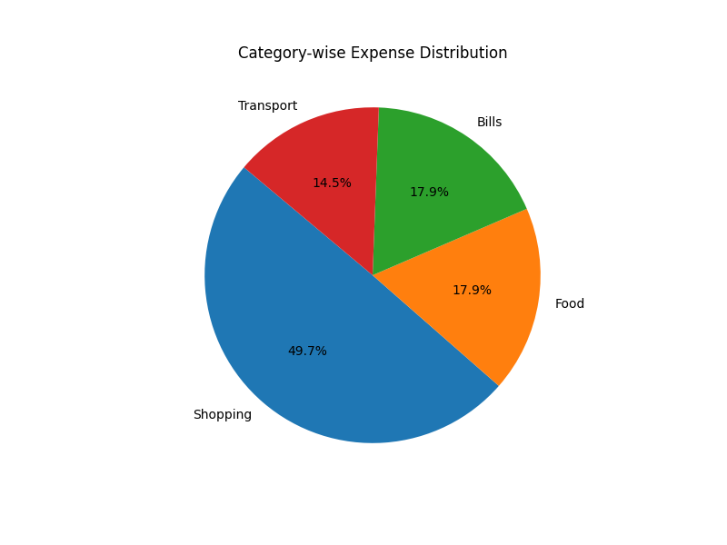
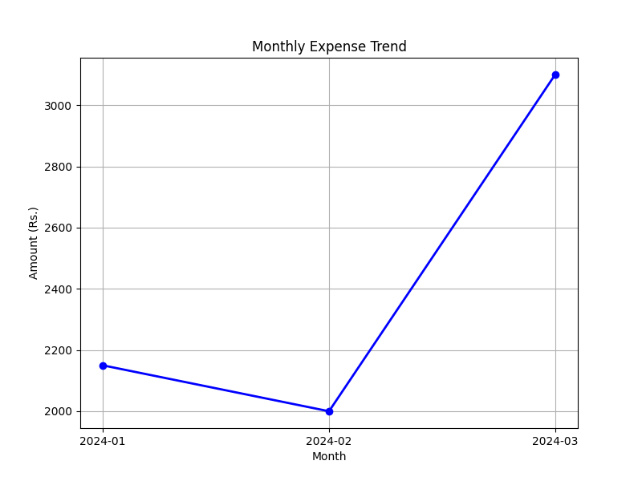

## 📊 Expense Analysis System

### About
Personal expense tracker built with Python and SQLite.
Analyzes spending patterns using SQL queries and visualizes data with Matplotlib charts.

### Technologies Used
- Python 3.12
- SQLite (Database)
- SQL (Data Analysis)
- Matplotlib (Visualization)

### Features
- Store daily expenses in database
- Category-wise expense analysis
- Monthly trend analysis
- Pie chart and Line chart visualization

### How to Run
1. Install matplotlib: py -m pip install matplotlib
2. Run: py expenses.py

### Output
- Total expenses calculated
- Category-wise breakdown (Food, Transport, Shopping, Bills)
- Monthly trends (Jan, Feb, Mar 2024)
- Highest expense identified
### Screenshots

